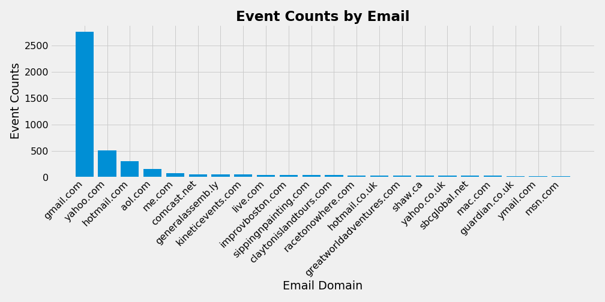

# Fraud Detection Case Study

## Table of Contents
1. [Motivation](#goal)
2. [Data and EDA](#data)
3. [Feature Modeling](#features)
4. [Model Selection & Performance](#model)
5. [Database Setup](#database)
6. [Web App](#app)

## 1. Motivation 

## 2. Data and EDA  

Once we loaded our JSON file into a dataframe, we had 14337 events with 44 columns, however a number of the columns had a lot of information, for instance, ticket types was a list of 

### EDA

---

## 3. Feature Modeling  

Of the initial 44 columns, 16 were used for features modeling in some fashion. 

### Country and Email

We created dummy variables out of the country and email domain columns after identifying countries and email domains that exhibited a high ratio of fraudulent activity.

Likewise, just using intuition, we created a new dummy variable called "intl_trans" that checks whether the user's country is the same as country of the venue for the event. 

We also created dummy variables out of whether the user was using facebook, twitter, and analytics, whether the organization name existed, all of which were correlated with nonfraudulent users. 

### Ticket Types

There was also a lot of information pulled out of the ticket_types column, which was actually a list of dictionaries. In general, we found that fraudulent events tended to have higher maximum and minimum costs for the tickets they offered, but also tended to offer fewer "tiers" of tickets – i.e. different tickets at different costs. We also calculated the "total" value that was at stake in the event; i.e. the sum of the cost of tickets at a certain tier multiplied by the quanity available. We anticipated that this could be useful in  

### Previous Payments and User Age

The previous payments column was a list of dictionaries with information on all of the previous payments that this user had made. We created a new variable that was a count of how many times previous payments had been made. Intuitively, users that had made a lot of payments were established and unlikely to be fraudulent. This proved to be by far the most important feature. Somewhat correlated with this was the user age. 

## 4. Model Selection & Performance  

We experimented with using boosted trees and random forests and ultimately settled on a random forest when it provided better performance. We did a statified test train split but opted not to use SMOTE or upsampling because we didn't want to train the model to predict overzealously. We decided to keep an eye on both recall and precision, since both false positives and false negatives could impose significant costs on our client in the form of lost money and annoyed customers. 

In terms of tuning the model, we experimented with increasing the number of trees above 100 or limiting the max depth, but found that neither led ot a noticeable improvement. Our best performing model had the following results:

===ACCURACY===
0.9860524091293322
===RECALL===
0.8875878220140515
===PRECISION===
0.9546599496221663
===F1===
0.9199029126213593

These were the most important features for the model:

## 5. Database Setup  

We created a database using postgres, but we didn't have time to set up a script to populate it. 

## 6. Web App  

We added our pickled model and scripts to get a new datapoint from the heroku servers, clean it in same way that we did with the dataframe, and predict whether or not the event was fraudulent or not. We modified the Web App to update every five seconds to check if theres a new 
