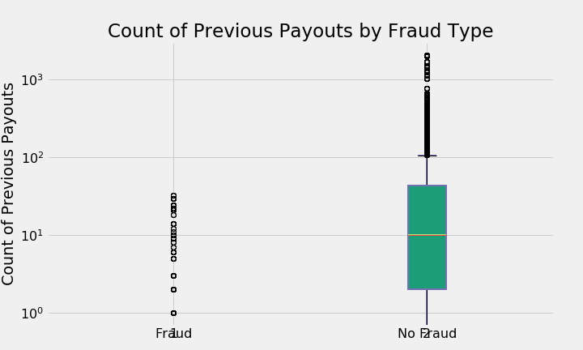

# Fraud Detection Case Study

## Table of Contents
1. [Motivation](#goal)
2. [Data and EDA](#data)
3. [Feature Modeling](#features)
4. [Model Selection & Performance](#model)
5. [Database Setup](#database)
6. [Web App](#app)
<!-- 7. [Implementation](#implement) -->

## 1. Motivation 

Text here

## 2. Data and EDA  

### 

### asdf

### asdf
---

## 3. Feature Modeling  

Of the initial 44 columns, X were used for features modeling in some fashion.

### Ticket Types

### Country

### Facebook / Twitter / Analytics

## 4. Model Selection & Performance  

## 5. Database Setup  

## 6. Web App  

#### Themes (you will be assessed on this)

* Software best practices (proper encapsulation and functions)
* product focus
* deploy models
* project scoping -- independence

#### Rough timeline 

* Wednesday: Project scoping, Model building, and an intro to Web apps
* Thursday: Web app and deployment

#### Deliverables

* model (properly commented and encapsulated on Github with a README)
* exposed API
* Data visualization (extra)

#### Assessment

* You will be assessed both on quality and cleanliness of code
* as well as a well functioning solution

#### Notes

* [building your model](model_notes.md): notes on how to get started with the dataset and how to save your model once you've trained it.
